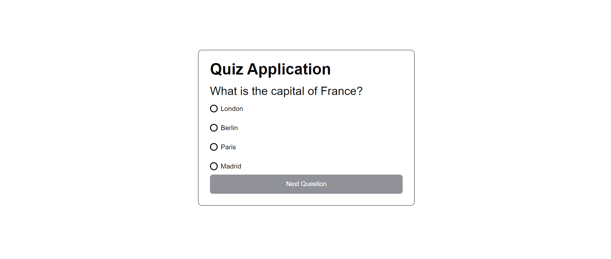

# This project was bootsrapped using a quiz application. Don't forget to change this readme 

## Quiz Application

This project is a quiz application that uses a mock server to generate questions and answers

## Features

- Error handling using `react-error-boundary`
- Simple quiz application using `react-query` for data fetching
- Tests for components using `react-testing-library` and `vitest`
- Styled using `styled-components`

## Installation

To get started with the project, clone the repository and install the dependencies:

```bash
git clone https://github.com/ezemery/elder_test.git

cd elder_test

npm install
```

## Usage

To run the application locally, use the following command:

```bash
 npm run dev
```

This will start the development server, and you can access the application at http://localhost:5173

## Testing

The project includes tests to ensure that errors are caught correctly and the fallback UI is displayed.

To run the tests, use:

```bash
 npm run test
```


